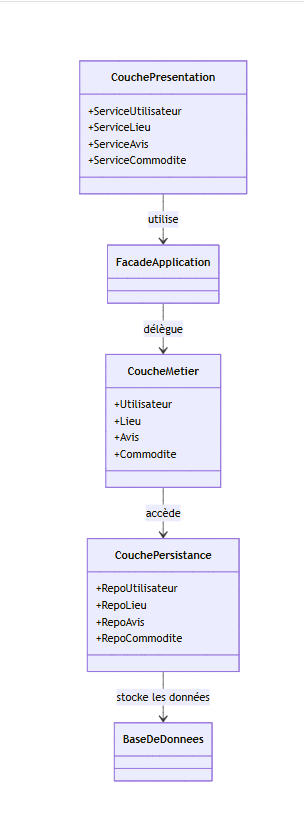
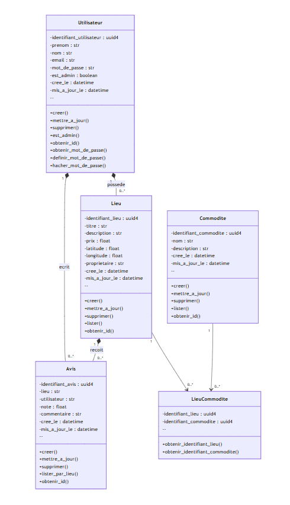
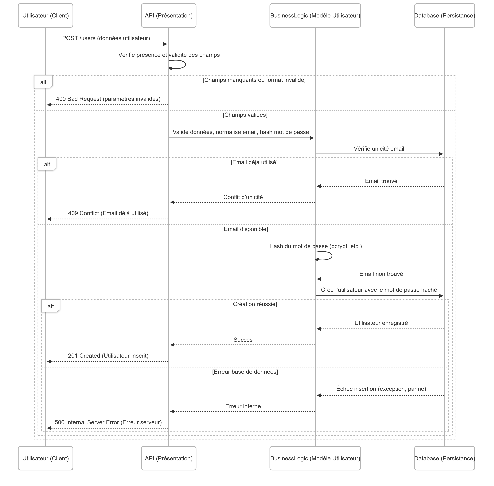
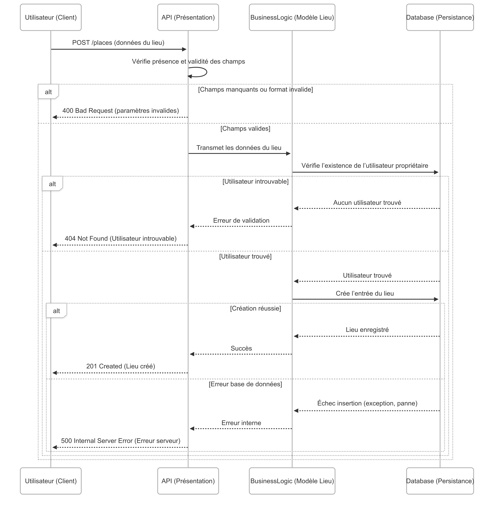
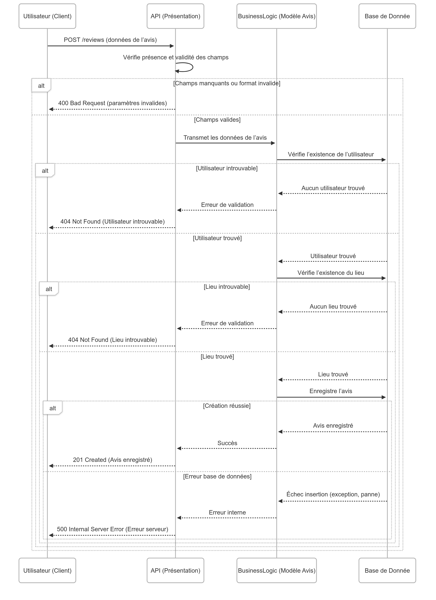
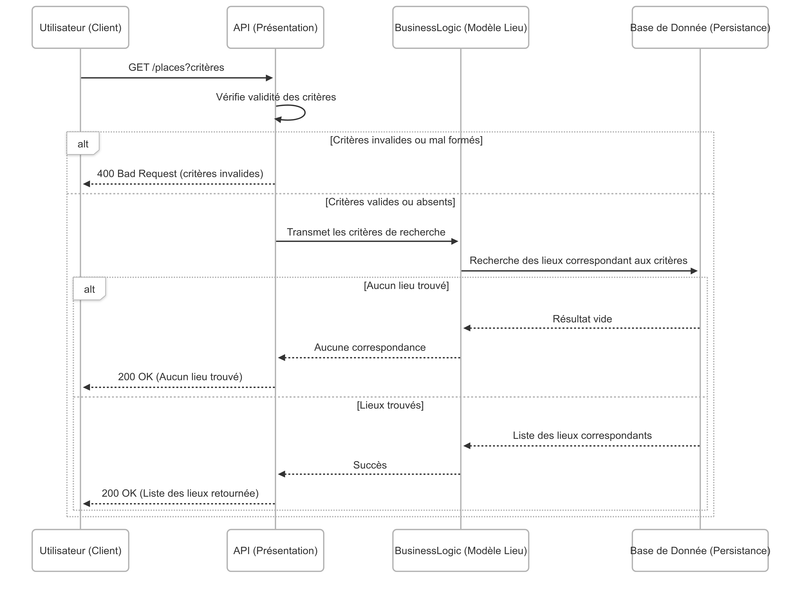

## Introduction  

### Objectif  
Fournir une vue d’ensemble du projet HBnB et expliquer l’objectif et la structure de ce document technique. Cette section introduit la documentation d’architecture et de conception présentée dans les sections suivantes.

### Description  
Ce document constitue une documentation technique complète du projet HBnB. HBnB est une application web permettant aux utilisateurs de publier, rechercher et évaluer des lieux de séjour, similaire à des plateformes comme Airbnb. L’application repose sur une architecture en trois couches : la couche Présentation, la couche Logique Métier, et la couche de Persistance.  

L’objectif principal de ce document est de servir de référence structurée pour la mise en œuvre de l’application. Il décrit l’architecture globale du système, les entités du modèle métier, ainsi que les interactions entre les différentes couches à travers des diagrammes UML et des explications associées.

## 📊 Diagramme de package de haut niveau

Cette section présente l’architecture logicielle de l’application HBnB Evolution à travers un diagramme de packages représentant les trois couches principales de l'application, selon le modèle layered architecture :

PresentationLayer : Cette couche comprend les services exposés aux utilisateurs (par exemple UserService, PlaceService, etc.). Elle est responsable de la gestion des requêtes externes et communique exclusivement avec la façade.

ApplicationFacade : Ce composant central implémente le façade pattern, servant d’interface unique entre la couche de présentation et la logique métier. Il permet de masquer la complexité de la couche métier tout en assurant un découplage fort.

BusinessLogicLayer : Contient les entités métier (User, Place, Review, Amenity) ainsi que les règles de gestion associées. C’est ici que sont centralisées les validations et décisions fonctionnelles.

PersistenceLayer : Cette couche est en charge de l'accès aux données, via des repositories (UserRepository, PlaceRepository, etc.) qui interagissent avec une base de données externe.

Ce diagramme permet d’avoir une vue d’ensemble claire de l’organisation du système, et met en évidence la séparation des responsabilités ainsi que le rôle central joué par la façade dans la coordination des échanges entre couches.

---

## 📊 Diagramme de Classe

Ce diagramme de classes décrit en détail la couche métier de l’application HBnB Evolution. Il inclut les entités principales du domaine, leurs attributs, méthodes et relations :

UserClass : représente les utilisateurs (administrateurs ou non). Elle inclut des méthodes classiques (CRUD), des accesseurs et des opérations liées à la gestion du mot de passe.

PlaceClass : représente les logements proposés sur la plateforme. Chaque Place est créé par un User et peut recevoir des Review. Il contient également des données géographiques (latitude, longitude).

ReviewClass : représente un avis déposé par un utilisateur sur un lieu. Il inclut une note (rating), un commentaire, ainsi que les références au User et au Place.

AmenityClass : représente les commodités disponibles dans les logements (Wi-Fi, ascenseur, etc.).

PlaceAmenity : classe d’association modélisant la relation many-to-many entre Place et Amenity. Elle permet une gestion flexible et évolutive de cette relation.

Chaque entité contient un identifiant unique (uuid4) ainsi que les champs created_at et updated_at pour la traçabilité. Les relations User → Place, User → Review et Place → Review sont modélisées en composition, traduisant une dépendance forte.
La présence de la classe PlaceAmenity permet de respecter les bonnes pratiques UML en modélisant proprement une relation multiple et potentiellement extensible.

## 📊 Diagrammes de séquence

Ce projet comprend quatre **diagrammes de séquence UML** illustrant les interactions entre les différentes couches de l'application HBnB :
- **l'utilisateur**
- la **couche de Présentation** (API),
- la **couche de Logique Métier** (Business Logic),
- et la **couche de Persistance** (Base de Données).

Ces diagrammes permettent de **visualiser le flux d’informations et de responsabilités** lors de l’exécution des principales opérations de l’application.

---

### 1️⃣ Enregistrement d’un utilisateur

Ce diagramme décrit le processus lorsqu’un utilisateur crée un nouveau compte via l’API.

- La requête est d’abord analysée pour valider les champs obligatoires (email, mot de passe, etc.).
- La couche métier vérifie que l’email n’est pas déjà utilisé dans la base de données.
- Si tout est valide, le mot de passe est haché (par exemple avec bcrypt), puis un nouvel utilisateur est créé et stocké dans la base.
- Des réponses d’erreur sont renvoyées en cas de doublon d’email, de champs invalides ou d’échec d’insertion.

**But :** garantir un enregistrement sécurisé et cohérent tout en gérant les erreurs communes.

---

### 2️⃣ Création d’un lieu (place)

Ce diagramme montre comment un utilisateur crée une nouvelle annonce de location (lieu).

- Après validation des champs (titre, prix, localisation, etc.), l’API transmet les données à la couche métier.
- Celle-ci vérifie que l'utilisateur existe et est autorisé à publier un lieu.
- Ensuite, le lieu est créé dans la base de données.
- Si une erreur survient (données manquantes, utilisateur inexistant, ou erreur interne), une réponse appropriée est retournée.

**But :** permettre à des utilisateurs authentifiés de publier des lieux tout en gérant les erreurs d’intégrité et de droits.

---

### 3️⃣ Soumission d’un avis (review)

Ce diagramme illustre le dépôt d’un avis par un utilisateur sur un lieu existant.

- L’API valide la note, le commentaire, et les identifiants fournis.
- La logique métier vérifie que l’utilisateur et le lieu existent.
- L’avis est ensuite stocké dans la base de données.
- Le diagramme inclut les cas d’erreur pour utilisateur ou lieu introuvable, ou données invalides.

**But :** permettre l’évaluation des lieux tout en s’assurant de l’authenticité des données et des entités impliquées.

---

### 4️⃣ Consultation d’une liste de lieux

Ce diagramme montre comment un utilisateur récupère une liste de lieux à partir de critères de recherche (localisation, prix, nombre de chambres, etc.).

- L’API valide les paramètres de requête.
- La logique métier transmet ces critères à la base de données.
- Selon le résultat, une liste de lieux ou une réponse vide est retournée.
- Le diagramme prend aussi en compte le cas où les critères sont invalides.

**But :** offrir une recherche flexible et efficace de lieux disponibles à la location.

---

## ✅ Conclusion

Ces diagrammes de séquence permettent de **clarifier l’architecture** de l’application HBnB et d'assurer que chaque couche respecte sa responsabilité :
- La **couche de présentation** gère la validation initiale et le formatage des réponses.
- La **logique métier** applique les règles spécifiques de l’application.
- La **persistance** est responsable de l’accès aux données.

Cette approche facilite la **maintenance, la scalabilité et la fiabilité** du système. Ces diagrammes servent aussi de **base de référence pour les futurs développeurs** du projet.

- **COULIBALY Beydi**  
  [@Beydi-dev](https://github.com/Beydi-dev)

- **ROUSSEAU Thomas**  
  [@Tomsonne](https://github.com/Tomsonne)
