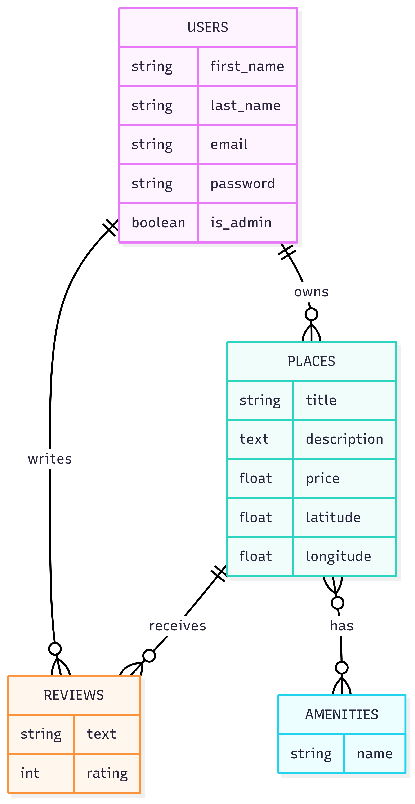

# ___HBnB - Backend API Project___

## ___📁 Project Structure___

- `app/`: Contient le code principal de l'application  
  - `api/`: Définition des endpoints Flask RESTX (v1)  
  - `models/`: Modèles de la couche métier (User, Place, Review, Amenity)  
  - `services/`: Couche de logique métier/facade  
  - `persistence/`: Couche d’accès aux données (repository en mémoire ou DB)  

- `run.py`: Point d’entrée pour lancer l’API Flask  
- `config.py`: Configuration de l’application (clé secrète, mode debug, etc.)  
- `requirements.txt`: Dépendances Python  
- `README.md`: Documentation principale du projet  

---

## ___⚙️ Installation___

```bash
# Cloner le repo
git clone https://github.com/Tomsonne/holbertonschool-hbnb.git
cd holbertonschool-hbnb

# Créer un venv (optionnel mais recommandé)
python3 -m venv venv
source venv/bin/activate

# Installer les dépendances
pip install -r requirements.txt
```

---

## ___🧠 Business Logic Layer___

La couche métier est découplée de l’API Flask et de la base de données, favorisant la modularité, les tests unitaires et la clarté du code.

### 📌 **Entités principales :**

#### `User`  
- Attributs : `id`, `first_name`, `last_name`, `email`, `is_admin`, `created_at`, `updated_at`  
- Responsabilités :  
  - Gérer l’identité et l’unicité de l’email  
  - Identifier les administrateurs  
  - Associer des `Place` et `Review`  

#### `Place`  
- Attributs : `id`, `title`, `description`, `price`, `latitude`, `longitude`, `owner`, `created_at`, `updated_at`  
- Responsabilités :  
  - Être associé à un `User` propriétaire  
  - Être affiché, filtré, évalué  
  - Valider prix et géolocalisation  

#### `Review`  
- Attributs : `id`, `text`, `rating`, `user`, `place`, `created_at`, `updated_at`  
- Responsabilités :  
  - Note entre 1 et 5  
  - Lien avec un `User` et un `Place`  

#### `Amenity`  
- Attributs : `id`, `name`, `created_at`, `updated_at`  
- Responsabilités :  
  - Être lié à un ou plusieurs `Place`  
  - Filtrer les lieux par équipements  

---

## ___🗃️ Entity-Relationship Diagram___



- `User` ⇨ possède des `Place` et des `Review`  
- `Place` ⇨ lié à plusieurs `Review` et `Amenity`  
- `Amenity` ⇨ partagé entre plusieurs `Place`  
- `Review` ⇨ relié à un `User` et un `Place`


---

## ___👥 Auteurs___

- Rousseau Thomas (https://github.com/Tomsonne)  
- Coulibaly Beydi (https://github.com/Beydi-dev)

